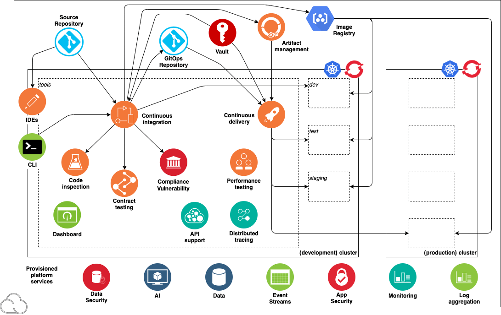

# Go Faster with the Cloud Native Developer Toolkit 

---
:information_source: **Note:** The instructions in this workshop and the overview image below are taken from the official Cloud Native Toolkit site https://cloudnativetoolkit.dev. They are a subset from what's available there, so that we can focus soley on the steps we want to accomplish in this workshop. However, feel free to explore the site and to get more background information on the different tools involved.

---

## Learning objectives

The Cloud-Native Toolkit is an open-source collection of assets that enable application development and that support teams to deliver business value quickly using a Red Hat OpenShift or IBM Cloud-managed Kubernetes. This workshop demonstrates how the toolkit can be used to support delivering business applications through the entire Software Development Life Cycle (SDLC). 

The toolkit has been built to support the principles of a robust SDLC while being flexible enough to fit into a wide range of development settings and toolchains. The key benefit is to make the end-to-end CI/CD development lifecycle consistent across each platform and make the out-of-the-box developer experience as simple as possible.

The workshop is split into the following sections:

* Prerequisites (access to an OpenShift cluster, work environment, etc.)

* Create your first application using one of the Cloud Native Toolkit Starter Kits

* Set up a DevOps pipeline for your application

* Continuous Delivery with Argo CD

Click the link below to get started & have fun!! Happy coding :smiley:

---

**[Let's get started with the hands-on part!!](openshift/1-Prereqs.md)**

---

## Resources

You can find detailed information and learn more about the Cloud Native Toolkit, OpenShift and cloud native development here:

* [Join the Call for Code Challenge](https://developer.ibm.com/callforcode/)

* [The Cloud Native Toolkit](http://cloudnativetoolkit.dev/)

* [OpenShift Labs](https://developer.ibm.com/openlabs/openshift)

* [IBM Cloud Free Tier](https://ibm.biz/Bdffsi)

* [Deploy apps with Code Engine](https://www.youtube.com/watch?v=sd1zM57TAB4)

* [Quarkus Getting Started](https://quarkus.io/get-started/)

* [IBM for Cloud Native](https://www.ibm.com/cloud/cloud-native)

