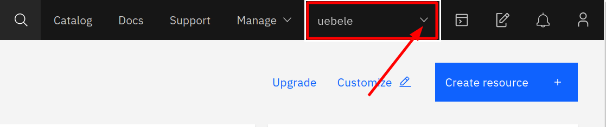

# Prerequisites

## 1. Access the IBM Cloud

We will use pre-provisioned Red Hat OpenShift clusters on the IBM Cloud for this workshop. You need an IBM Cloud Account to assign yourself one of these clusters:

1. You can register at [https://cloud.ibm.com](https://ibm.biz/Bdqkfz).

    We need your email address, a password, your name, and your country. 
    
    During the registration, we will send a verification code to your email address that you have to enter into the registration form. 
    
    Registration is free and without any obligations.

1. Logon to the IBM Cloud Dashboard [https://cloud.ibm.com](https://cloud.ibm.com).

## 2. Assign yourself a pre-provisoned cluster

In this step you will assign yourself a pre-provisioned cluster. 

1. Your lab instructor will provide a link to an application and a "lab key". Open the application in your browser:

   Sign up for the Free Openshift Lab cluster here: 
   
   URL: **https://osdevopslab.mybluemix.net/**  
   **key: oslab**

   
   
2. Enter the lab key provided and your IBMid (it is the email address you used to register at the IBM Cloud), agree to the T&Cs, and click "Submit":
   
   
   
   Of course your cluster will be named differently and the lab account you need to select from the pull-down in the IBM Cloud Dashboard is **1840867 - Advowork**.
   
## 3. Work Environment

To see details about your assigned cluster and access the OpenShift Web Console follow these steps:

1. Go back to the IBM Cloud Dashboard (step 1)

1. In the title bar, open the Accounts pull-down menu (you may need to refresh your browser) and select the lab account **1840867 - Advowork**:
   
     

1. Select __OpenShift -> Clusters__ from the burger menu:
   
   

1. This will display your list of available clusters with one entry:
   
   

1. Click on the entry, this displays all the details about your cluster:
   
   

1. Access the OpenShift Web Console with the blue button. The OpenShift Web Console will open in a new tab.
   
   
   
   Keep the Web Console open!


### The IBM Cloud Shell

We will work with OpenShift in the Web Console and in the command line, using different CLIs. The IBM Cloud Shell is a web based shell (terminal) that has all the required tools available. 

1. Access IBM Cloud Shell using the icon in the title bar. Make sure you are in the IBM account (1840867 - Advowork)!:  
   
   

1. It will take a moment to set up a session. The Cloud Shell offers 500 MB of temporary storage and the session will close after 1 hour of inactivity. The workspace data will be removed then.

1. Go back to the OpenShift Web Console. In the upper right corner open the pull down and select "Copy Login Command":
   
   

1. A new browser tab opens, click on "Display Token", and on the next screen, copy the command to "Log in with this token":
   
   

1. Go back to your IBM Cloud Shell session, paste the command and execute it:
   
    
   
   Test access to OpenShift:
   
   ```bash
   $ oc projects
   ```
   
   This should display a whole list of projects/namespaces that you could access on OpenShift.  


## 4. Set up the Cloud Shell environment for use with the Cloud Native Toolkit

1. Set up the shell environment by running:

   ```bash
   curl -sL shell.cloudnativetoolkit.dev | bash -
   ```

2. If successful, the output should be similar to:

   ```
   Downloading scripts: https://github.com/cloud-native-toolkit/cloud-shell-commands/releases/download/0.3.5/assets.tar.gz
   ** Installing argocd cli
   ** Installing tkn cli
   ** Installing kube-ps1
   ** Installing icc
   ** Installing Cloud-Native Toolkit cli
   
   kube-ps1 has been installed to display the current Kubernetes context and namespace in the prompt. It can be turned on and off with the following commands:
   
      kubeon     - turns kube-ps1 on for the current session
      kubeon -g  - turns kube-ps1 on globally
      kubeoff    - turns kube-ps1 off for the current session
      kubeoff -g - turns kube-ps1 off globally

   Your shell configuration has been updated. Run the following to apply the changes to the current terminal:

      source ~/.zshrc
   ```

3. Follow the instruction given at the end of the output to enable the changes in the current terminal session. That is, run

   ```bash
   source ~/.zshrc
   ```

4. You can check the shell was installed correctly by checking the oc sync version:

   ```bash
   oc sync --version
   ```

   This returns the `igc` version number.
---

__Continue with the next part [Create an application](2-CreateApplication.md)__
      
