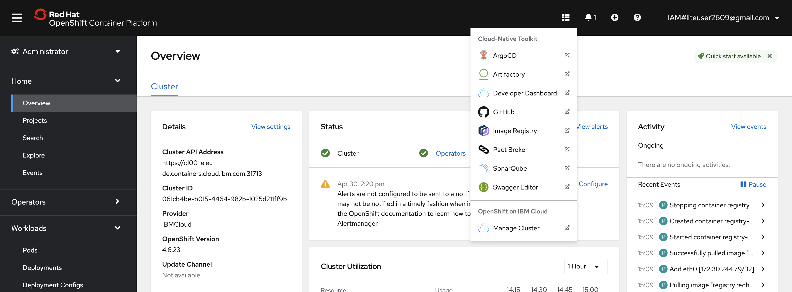
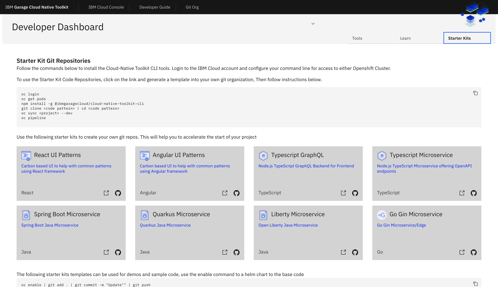
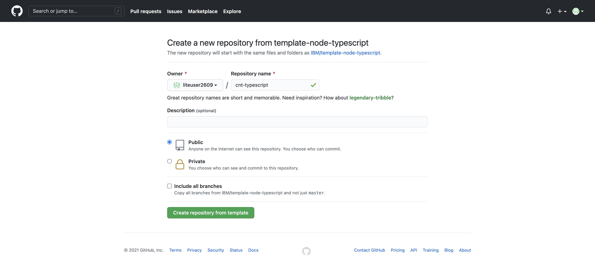

# Create your first application with the Toolkit

In the previous section we have installed all the necessary CLI tools and we have tested the connection to our assigned and pre-provisioned cluster. In this part of the workshop we will create our first application using one of the Cloud Native Toolkit started kits. For this, first make sure the connection to the cluster is still active. To check this, switch tab to your Cloud Shell and type the following command:

```bash
$ oc project
```

This should return the project that is currently active. If you receive an error message telling that you are not logged on, complete the [Copy Login Command](1-Prereqs.md#the-ibm-cloud-shell) steps from the previous section.

## Create the development namespace

One of the first steps in the process would be the creation of a development namespace / project. This project will contain the development version of the application and the DevOps pipelines. This is something that would typically happen once at the beginning of a project, when a development team is formed and assigned to the cluster.

This step copies the common secrets and configMaps that contain the CI/CD configuration from the tools namespace into the development namespace / project. This enables the pipelines to reference the values easily for your project. To create your own development namespace, switch tab to a Cloud Shell again and type:

```bash
$ oc sync ${DEV_NAMESPACE}
```

where `${DEV_NAMESPACE}` is the name you've chosen for your development namespace / project.

## Open the Developer Dashboard

The Developer Dashboard makes it easy for you to navigate to the tools, including a section that allows you to select a set of preconfigured Starter Kits that make seeding your development project very easy.

1. For this, open a tab in your browser and make sure you are logged on to Github. 

2. Next, navigate to the OpenShift web console and open the Application Launcher dropdown from the top-right (1) and select Developer Dashboard (2). 

3. If prompted, click **Log in with OpenShift** and click **Allow selected permissions** to allow the service account developer-dashboard to obtain the necessary read-only access to your account.

    

## Create your application in Github

---
:warning: **Warning:** &nbsp; Your browser needs to be logged in to your GitHub account for a template to work. If the link from the tile displays the GitHub 404 page, log in and reload the page.

---

1. From the Developer Dashboard, click on the **Starter Kits** tab.

2. Pick one of the templates that is a good architectural fit for your application and the language and framework that you prefer to work with. For your first application, select the **Typescript Microservice**. This also works well in the Cloud Shell and is perfect for this workshop.

    

    Click on a Starter Kit **Tile** to create your app github repository from the template repository selected.  You can also click on the Git Icon to browse the source template repository and click on the Template to create the template.

3. Next, complete the [GitHub create repository from template](https://help.github.com/en/github/creating-cloning-and-archiving-repositories/creating-a-repository-from-a-template) process.

    * **Owner**: Select a valid GitHub organization that you are authorized to create repositories within.
    * **Repository name**: Enter a name for your repo. GitHub will help with showing a green tick if it is valid (See warning above).
    * **Description**: Describe your app. This is optional.

4. Press **Create repository from template**.

    

    The new repository will be created in your selected organization.

---

__Continue with the next part: [Create the DevOps pipeline](3-Pipelines.md)__
