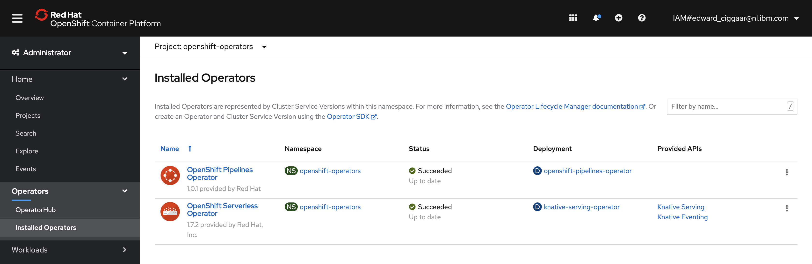
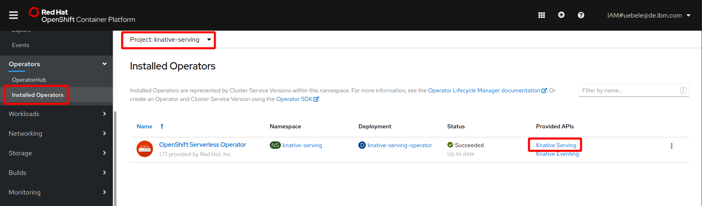
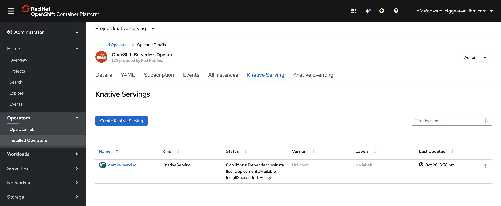
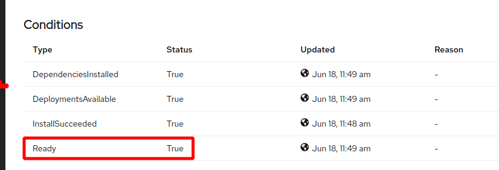

# Installing Required OpenShift Operators 

Two operators need to be installed to successfully complete this workshop, the OpenShift Serverless Operator and the OpenShift Pipelines operator. This can be done via the UI or via the command line. 


## Install using the CLI
In this section, the steps for the command line are listed. 

1. For this, switch tab to your IBM Cloud Shell session and go the root of the cloned git repository from the previous step.

   ```bash 
   $ cd ~/devops-workshop/scripts
   ```

1. Next, run the following script:

   ```bash
   $ ./create-workshop-prereqs.sh
   ```
   
   the output should end with something similar to:

   ```
   waiting for completion...
   waiting for completion...
   {
     "lastTransitionTime": "2021-01-25T09:45:57Z",
     "message": "Dependency installing: Kourier",
     "reason": "Installing",
     "status": "False",
     "type": "Ready"
   }
   {
     "lastTransitionTime": "2021-01-25T09:45:54Z",
     "message": "Waiting on deployments",
     "reason": "NotReady",
     "status": "False",
     "type": "Ready"
   }
   
   DependenciesInstalled=True
   DeploymentsAvailable=True
   InstallSucceeded=True
   Ready=True
   VersionMigrationEligible=True
   
   ==> Done!
      
   ==> Creating the OpenShift project for this workshop
   Now using project "devops-workshop" on server "https://c102-e.eu-de.containers.cloud.ibm.com:32384".
   
   You can add applications to this project with the 'new-app' command. For example, try:
   
       oc new-app rails-postgresql-example
   
   to build a new example application in Ruby. Or use kubectl to deploy a simple Kubernetes application:
   
       kubectl create deployment hello-node --image=k8s.gcr.io/serve_hostname
   
   ==> Done!
   
   ==> ****************************************************
   ==> 
   ==> Successfully installed DevOps workshop pre-reqs
   ==> 
   ==> ****************************************************
   ```

This script creates a subscription to both the serverless and the pipelines operator, it creates the `knative-serving` namespace and it installs the Knative Serving pane.

1. When the script completed successfully, go the Web Console and check that both operators are present under 'Operators' -> Installed Operators'
   
    

1. To verify that the Knative Serving API was successfully enabled, change to the 'knative-serving' project. Make sure you're still at the 'Installed Operators' page and click on the 'Knative Serving' API.
   
   

1. This opens the following page:

   

1. Click on the Name 'knative-serving'. In the 'Overview' scroll down to Conditions. You can see all 4 conditions are true, including 'Ready':
   
   
   
   Note that the shell script reported exaclty the same status. In the 'Resources' tab you will see many deployments, services, pods, all should be 'Created' or 'Running'. 

---

__Continue with the next part [Create an OpenShift Pipeline and deploy your Quarkus application with it](3-Pipelines.md)__    
