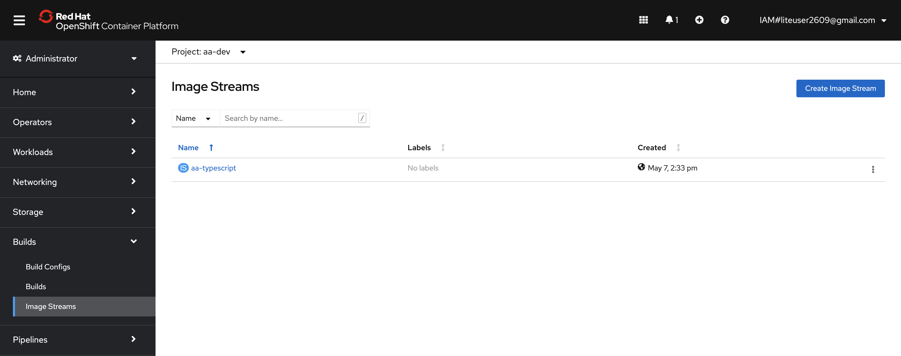
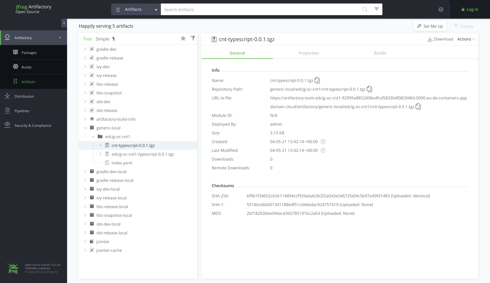

# Create the DevOps pipeline

## Register your application in a DevOps Pipeline

---
**Info** :information: &nbsp; We will be using the pipeline command of the IBM Garage Cloud cli to register the DevOps pipeline. The pipeline command gives an option for both Jenkins and Tekton. For more information about working with the different build engines, please see Continuous Integration with Jenkins Guide and Continuous Integration with Tekton Guide

---

1. Open a browser to the Git repository created in the previous step.

2. Copy the url to the Git repository. For GitHub this is done by pressing the Code button and copying the url provided in the Clone section.

3. Start the process to create a pipeline.

    ```bash
    $ oc pipeline ${GIT_URL}
    ```

    For example:

    ```bash
    $ oc pipeline https://github.com/gct-showcase/inventory-svc
    ```

4. For the deployment of your first app with OpenShift select Tekton as the CI engine.

5. The first time a pipeline is registered in the namespace, the CLI will ask for a username and Password/Personal Access Token for the Git repository that will be stored in a secret named git-credentials.
Username: Enter your GitHub user id
Personal Access Token: Paste your GitHub personal access token

6. When registering a Tekton pipeline, the CLI will attempt to determine the runtime used by the repository that was provided and filter the available pipelines. If only one matches then it will be automatically selected. If it cannot find a match or there is more than one match then you will be prompted to select the pipeline.

7. When registering a Tekton pipeline, the CLI also reads the available parameters from the pipeline and generates prompts for input. In this case, the option of scanning the built image for vulnerabilities is the only options. The scan is performed by the Vulnerability Advisor if you are using IBM Image Registry or by Trivy if another image registry is used. This scan is performed in "scan" stage of pipeline after "img-release" stage.

    ```
    ? scan-image: Enable the pipeline to scan the image for vulnerabilities?(Y/n)
    ```

8. To skip the scan, you have type "n" (No).Otherwise, type "y" (Yes) for performing Vulnerability Scanning on the image.

9. After the pipeline has been created,the command will set up a webhook from the Git host to the pipeline event listener.

    ---
    **Note** :pencil: &nbsp; If the webhook registration step fails, it is likely because the Git credentials are incorrect or do not have enough permission in the repository.

    ---

10. When the command is completed it will present options for next steps. You can use the Tekton cli commands to inspect the pipeline run that has been created and tail the log and/or navigate to the provided url to see the pipeline running from the OpenShift console.

## View your application pipeline

1. The steps to view your registered pipeline will vary based on the type of pipeline (Jenkins or Tekton) and container platform version. For this workshop we use a Tekton pipeline and OpenShift as container platform. So for this, return to your OpenShift web console or type

    ```bash
    oc console
    ```

    in your Cloud Shell to get the URL to the web console. Finally, copy and paste the URL in a seperate tab to actually open it.

2. Next, from the menu on the left switch to the Developer mode.

3. Select the *dev* project that was used for the application pipeline registration --- i.e. your `${DEV_NAMESPACE}` project.

4. In the left menu, select *Pipelines*

    You should see your application DevOps pipeline running. Once completed, the pipeline run will look like the image below.

    


## View your application artifacts

The pipeline built two artifacts for deploying your app:

* Container image -- The image registry includes a container image with your app built in
* Helm chart -- The artifact repository includes a Helm chart repository that includes a Helm chart for deploying your app

Let's look at these artifacts in the Toolkit environment.

The container image is stored in the IBM Cloud Container Registry:

1. From the OpenShift console's tools menu or from the Developer Dashboard's tools page, select Image Registry.

2. In the image regisry, you'll see the image the pipeline built for your app, such as us.icr.io/isv-scenarios/stockbffnode-bw with a different tag for each build.
Image Registry

  

  The Helm chart is stored in Artifactory:

1. From the OpenShift console's tools menu or from the Developer Dashboard's tools page, select Artifactory.

2. In the Artifactory console, select Artifactory > Artifacts > generic-local. You'll see a `isv-scenarios` folder with a different chart for each build, such as `generic-local/isv-scenarios/stockbffnode-bw-0.0.1.tgz`.

  

## Access the running app

Once the pipeline has completed successfully, the app will be deployed into the namespace used when registering the pipeline. To validate the app is running follow these steps:

---
**Note**

Be sure the namespace context is set correctly before running the following commands

---

Open/switch tab to the Cloud Shell and use the command below to retrieve the app ingress endpoint.

```bash
$ oc endpoints
```

From the endpoints listed, select the URL for the repo that was just deployed and press Enter to open that URL in a web browser. Validate the application is working as expected.

## Locate the app in the web console

The build pipeline is configured to build the source code from the Git repository into a container image. This image is stored in the Image Registry. After that, the image is deployed into the same namespace/project within the development cluster where the pipeline ran and validated for its health. The steps below will walk through locating the installed application within the Web Console.

1. Open the OpenShift web console, or in your Cloud Shell type

    ```bash
    oc console
    ```
    and copy/paste the URL into a separate tab to open the console.

2. Change to the Developer view

3. Click on Topology menu

4. Click on your application deployment in the topology view

5. Click on the Overview tab

6. Increase the number of running pods to 2 pods

7. Click on the Resources tab to view the list of pods

8. Click on View Logs link to view the logs from each pod

9. You can see the running state of your application

  


Success
You now have your application running inside your development cluster and being delivered using a Tekton based CI pipeline. This is the beginning of the developer journey with IBM Cloud.

Having reached this point, we recommend you repeat the process a few more times using different Code Patterns templates and explore the Developer view in OpenShift to get familiar with it.

---

__Continue with the next part [Continous Delivery with Argo CD](4-ContinousDelivery.md)__
