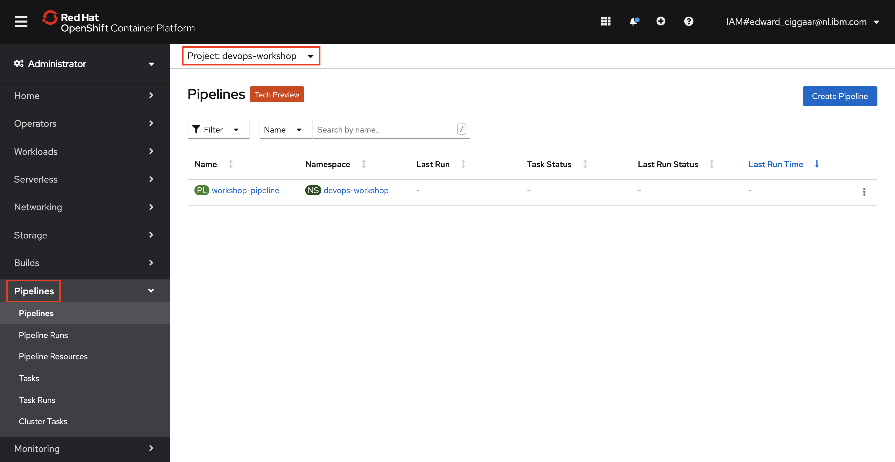
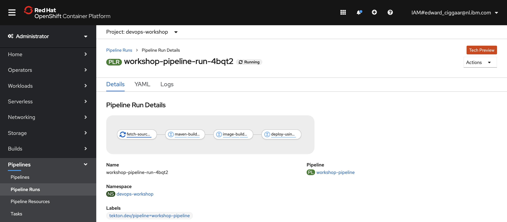
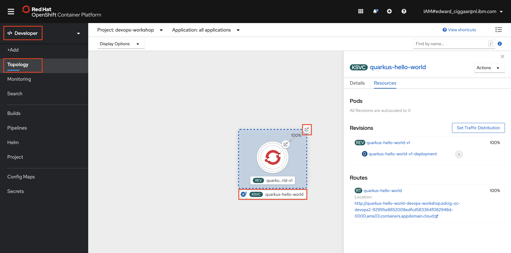
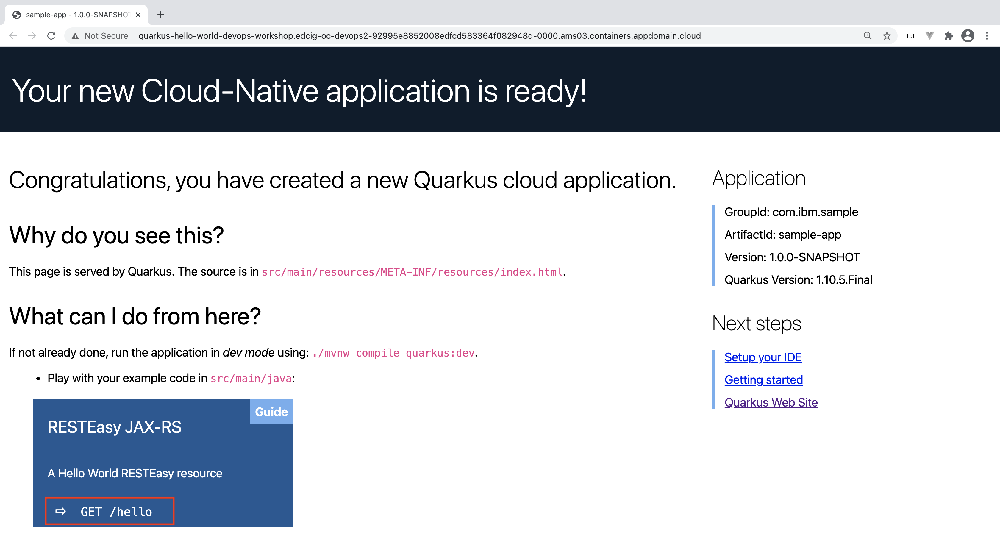
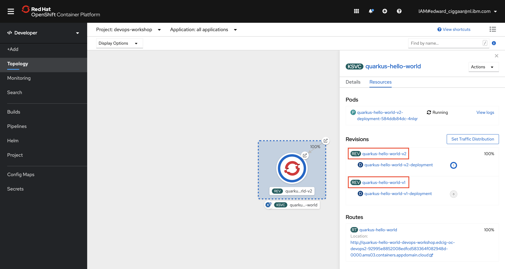

# Create an OpenShift Pipeline and deploy your Quarkus application with it

## Creating the pipeline

A pipeline consists of multiple so-called tasks that are executed in sequence and/or parallel. Tasks in their turn can contain one ore more steps. To get our code deployed to OpenShift, a couple of steps need to be executed. First, we need to fetch our source code. Then we need to build and test our Java code. Next, a Docker image needs to be created containing the runnable JAR. Finally, this Docker image needs to be deployed to the OpenShift cluster as a Knative service. 

The retrieval of the source code is done in the first task called `fetch-source-repository`. The building and testing of the Java code is done in the `maven-build-and-test` task. Then, the using the `Dockerfile.jvm` file generated by our Quarkus Hello World project, the JAR file from the previous task is built into a Docker image and pushed to the local image registry. These steps are performed in the `image-build-and-push` task. Finally, in the `deploy-using-kn` task, the generated Docker image is used to deploy a Knative service on OpenShift. To share resources the tasks leverage so-called workspaces.

All this logic is grouped together in what is called an OpenShift Pipeline. Take a look at the YAML below. 

```yaml
apiVersion: tekton.dev/v1beta1
kind: Pipeline
metadata:
  name: workshop-pipeline
  namespace: devops-workshop
spec:
  description: |
    This pipeline will clone a given repository revision, build a Quarkus application,
    pushing the final image into the Openshift internal registry and finally, deploy 
    the application as a Knative service on the OpenShift cluster
  params:
  - name: source-repo-url
    type: string
    description: The git repository URL to clone from.
    default: https://github.com/eciggaar/devops-workshop-code.git
  - name: source-revision
    type: string
    description: The git revision to clone.
    default: 19e3c62ae20b65ab977a1000a1bdec002e753120
  - name: image-registry
    type: string
    description: Image registry
    default: image-registry.openshift-image-registry.svc.cluster.local:5000
  - name: image-repository
    type: string
    description: Image repository within image-registry the image will be pushed to
    default: devops-workshop
  - name: dockerfile
    type: string
    description: Dockerfile location used to build the final image
    default: ./src/main/docker/Dockerfile.jvm
  workspaces:
  - name: source
  - name: maven-settings
  tasks:
  - name: fetch-source-repository
    taskRef:
      name: git-clone
      kind: ClusterTask
    workspaces:
    - name: output
      workspace: source
    params:
    - name: url
      value: $(params.source-repo-url)
    - name: revision
      value: $(params.source-revision)
    - name: subdirectory
      value: $(params.source-revision)
    - name: deleteExisting
      value: "true"
  - name: maven-build-and-test
    taskRef:
      name: maven
      kind: ClusterTask
    runAfter:
      - fetch-source-repository
    workspaces:
      - name: source
        workspace: source
      - name: maven-settings
        workspace: maven-settings
    params:
      - name: GOALS
        value: ["-f", "$(params.source-revision)/pom.xml", "clean", "package"] 
  - name: image-build-and-push
    taskRef:
      name: buildah
      kind: ClusterTask
    params:
      - name: TLSVERIFY
        value: "false"
      - name: IMAGE
        value: $(params.image-registry)/$(params.image-repository)/quarkus-hello-world:$(params.source-revision)
      - name: CONTEXT
        value: $(workspaces.source.path)/$(params.source-revision)
      - name: DOCKERFILE
        value: $(params.dockerfile)
    workspaces: 
      - name: source 
        workspace: source 
    runAfter:
      - maven-build-and-test
  - name: deploy-using-kn
    taskRef:
      name: kn
      kind: ClusterTask
    params:
      - name: kn-image
        value: 'gcr.io/knative-releases/knative.dev/client/cmd/kn:latest'
      - name: ARGS
        value:
          - service
          - create
          - quarkus-hello-world
          - --image=$(params.image-registry)/$(params.image-repository)/quarkus-hello-world:$(params.source-revision)
          - --revision-name=quarkus-hello-world-v1
          - --env=GREETING_MESSAGE=Hello DevOps Workshop v1
          - --force      
    runAfter:
      - image-build-and-push      
  finally:  
    - name: cleanup-source-workspace
      taskRef:
        name: workspace-cleaner
      workspaces:
        - name: root-workspace
          workspace: source
      params:
        - name: directory
          value: $(params.source-revision)
```

This YAML describes the pipeline that is used in this workshop. Note how it is built up, referencing the tasks that are used, the pipelines parameters, workspaces, etc.

1. To create this pipeline in your own environent, switch tab to your IBM Cloud Shell. Then, change directory to `devops-workshop/scripts`.

    ```bash
    $ cd ~/devops-workshop/scripts
    ```
    and run the following script:

    ```bash
    $ ./create-pipeline-resources.sh
    ```

  This script creates the custom tasks, workspaces and the pipeline itself -- all in the `devops-workshop` namespace. The output should be similar to:

  ```
  ==> **************************************************
  ==> 
  ==> Create DevOps workshop pipeline
  ==> 
  ==> **************************************************

  ==> Switching to project for this workshop
  Already on project "devops-workshop" on server "<your-server>".
  ==> Done!

  ==> Creating a persistant volume claim and fetch git repo and a Maven config map for the settings.xml
  persistentvolumeclaim/source-pvc created
  configmap/maven-settings created
  ==> Done!

  ==> Adding a custom Tekton task to clean up the workspace as last step of the pipeline
  task.tekton.dev/workspace-cleaner created
  ==> Done!

  ==> Creating workshop OpenShift Pipeline
  pipeline.tekton.dev/workshop-pipeline created
  ==> Done!

  ==> ****************************************************
  ==> 
  ==> Successfully created DevOps workshop pipeline
  ==> 
  ==> ****************************************************
  ```

  To verify that everything is in place, check the Pipelines section in the OpenShift Web Console. It should list the workshop pipeline and custom task created by the script.

   

  You can also check the presence of your tasks using the command line. For this,

2. In your IBM Cloud shell use the Tekton CLI to get a list of your custom tasks:
  
    ```bash
    $ tkn task list
    ```
    Similar, for the pipeline itself:

    ```bash
    $ tkn pipeline list
    ```

3. The OpenShift CLI can be used to check the persistant volume claim and configmap that has been created by the script. To see the persistant volume claims, execute the following command in Cloud Shell:

    ```bash
    $ oc get pvc
    ```
    Make sure the status is set to `Bound` and not `Pending`. This might take a minute or so. You can rerun the above command to retrieve the latest status. To verify the ConfigMap is created, enter:

    ```bash
    $ oc get cm

## Running the pipeline

Having successfully created all pipeline artifacts, we can now run the pipeline. 

1. For this, enter:

    ```bash
    $ tkn pipeline start workshop-pipeline -w name=source,claimName=source-pvc -w name=maven-settings,config=maven-settings
    ```

    Accept the defaults for all parameters. The `-w` option in the above command are used to configure the workspaces used by the pipeline. The result of the pipeline start should be similar to:

    ```bash
    $ tkn pipeline start workshop-pipeline -w name=source,claimName=source-pvc -w name=maven-settings,config=maven-settings
    ? Value for param `source-repo-url` of type `string`? (Default is `https://github.com/eciggaar/devops-workshop-code.git`) https://github.com/eciggaar/devops-workshop-code.git
    ? Value for param `source-revision` of type `string`? (Default is `19e3c62ae20b65ab977a1000a1bdec002e753120`) 19e3c62ae20b65ab977a1000a1bdec002e753120
    ? Value for param `short-source-revision` of type `string`? (Default is `19e3c62`) 19e3c62
    ? Value for param `image-registry` of type `string`? (Default is `image-registry.openshift-image-registry.svc.cluster.local:5000`) image-registry.openshift-image-registry.svc.cluster.local:5000
    ? Value for param `image-repository` of type `string`? (Default is `devops-workshop`) devops-workshop
    ? Value for param `dockerfile` of type `string`? (Default is `./src/main/docker/Dockerfile.jvm`) ./src/main/docker/Dockerfile.jvm
    PipelineRun started: workshop-pipeline-run-b24tr

    In order to track the PipelineRun progress run:
    tkn pipelinerun logs workshop-pipeline-run-b24tr -f -n devops-workshop
    ```

1. As mentioned by the output, you can monitor the progress of the pipeline run as follows:

    ```bash
    $ tkn pipelinerun logs workshop-pipeline-run-b24tr -f -n devops-workshop
    ```

    Note that your pipeline run name is different from the one shown above. Also, it may take a little bit before logs are being shown here...

    You can also monitor the progress of your deployment using the OpenShift Web Console. 

1. For this, open the Web Console. In the Pipelines -> Pipeline Runs section you find your running pipeline. Typically, you would see something like:

     

    Click on one of the tasks to get to the logs of your running pipeline. Below the result is shown when clicking the `fetch-source-repository` task.

     

    As you might have noticed, by the time this screenshot was taken, the Pipeline Run already successfully completed. 

## So what got deployed? :smiley:

At this point we deployed our Quarkus application to Openshift using a pipeline. Let's have a look at the application. For this,

1. Switch tab to the OpenShift Web Console, open the 'Developer' view and select 'Topology'. Make sure the 'devops-workshop' project is selected.

     

    Now click the KSVC tag to view the details (pods, revisions, routes, etc.) of the Knative service. Click the route to open the application. The result should be similar to: 

     

    You can click the `hello` endpoint to see the result of the GET request. This should be similar to `Hello DevOps Workshop v1`.

### Knative Revisions

A Knative Revision is a specific version of a code deployment of a Knative service.

If you deploy a new version of an application in Kubernetes, you typically change its service definition. It's good practice to then commit and push this changed deployment definition into a dedicated configuration Git repository. Finally, the push to the repo should trigger a rolling update of the application from the old to the new version.

For the sake of simplificity in this workshop, we will make a change to the `GREETING_MESSAGE` environment variable and manually trigger the pipeline. This causes a new revision of our application to be deployed using the pipeline.

1. For this, switch tab to the IBM Cloud Shell and make sure `devops-workshop` is your current project. Then, edit the pipeline by running:

    ```bash
    $ oc edit pipeline workshop-pipeline
    ```

    The pipeline opens in editing mode with vi as editor. 

1. Now, search for the string `env=GREETING_MESSAGE` by typing `/` followed by:

    ```
    env=GREETING_MESSAGE
    ```

    Hit \<ENTER\> and type `n` once to go the next search result. You should now be at the following line:

    ```
    - --env=GREETING_MESSAGE=Hello DevOps Workshop v1
    ```

1. Next, type `<SHIFT> + a`. You should now be in editing mode and at the end of the line. Change to the value of `GREETING_MESSAGE` to something like:

    ```
    - --env=GREETING_MESSAGE=Hello DevOps Workshop v2 UPDATE!!!
    ```

1. A couple of lines above change the `revision-name` to:

    ```
    - --revision-name=quarkus-hello-world-v2
    ```

1. Finally, save your changes by pressing `<Esc>`, followed by type `:wq`. You should see the following output:

    ```
    pipeline.tekton.dev/workshop-pipeline edited
    ```

1. Use the Tekton CLI to run the pipeline again:

    ```bash
    $ tkn pipeline start workshop-pipeline -w name=source,claimName=source-pvc -w name=maven-settings,config=maven-settings
    ```

    Accept the defaults again and check the logs or monitor the deployment via the Web Console. Wait for it to successfully complete.

1. Next, check the Knative service by typing:

    ```bash
    $ kn service describe quarkus-hello-world
    ```

    the output should be similar to:

    ```
    Name:       quarkus-hello-world
    Namespace:  devops-workshop
    Age:        44m
    URL:        http://quarkus-hello-world-devops-workshop.edcig-oc-devops2-92995e8852008edfcd583364f082948d-0000.ams03.containers.appdomain.cloud

    Revisions:  
      100%  @latest (quarkus-hello-world-v2) [2] (28s)
            Image:  image-registry.openshift-image-registry.svc.cluster.local:5000/devops-workshop/quarkus-hello-world:19e3c62ae20b65ab977a1000a1bdec002e753120 (pinned to 9f4230)

    Conditions:  
      OK TYPE                   AGE REASON
      ++ Ready                  11s 
      ++ ConfigurationsReady    11s 
      ++ RoutesReady            11s 
    ```

    Note that the `[2]` indicates that we currently have two revisions and in this case 100% load on the `quarkus-hello-world-v2` revision.

1. Back in the OpenShift Web Console, Topology view:

    

    It hasn't changed a lot, but notice the two revisions in the 'Resources' section where revision `quarkus-hello-world-v2` has 100%. Its the same 100% we could see in the previous step using the Knative CLI.

1. Click on the Route. This should display the output of the latest revision ("Hello DevOps Workshop v2 UPDATE!!!").

    Back in the Web Console, a pod will be started for Revision `quarkus-hello-world-v2`. It will scale to zero after a moment. 

---

__Continue with the next part [Knative Traffic Management](4-TrafficManagement.md)__

