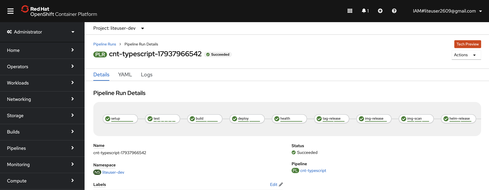
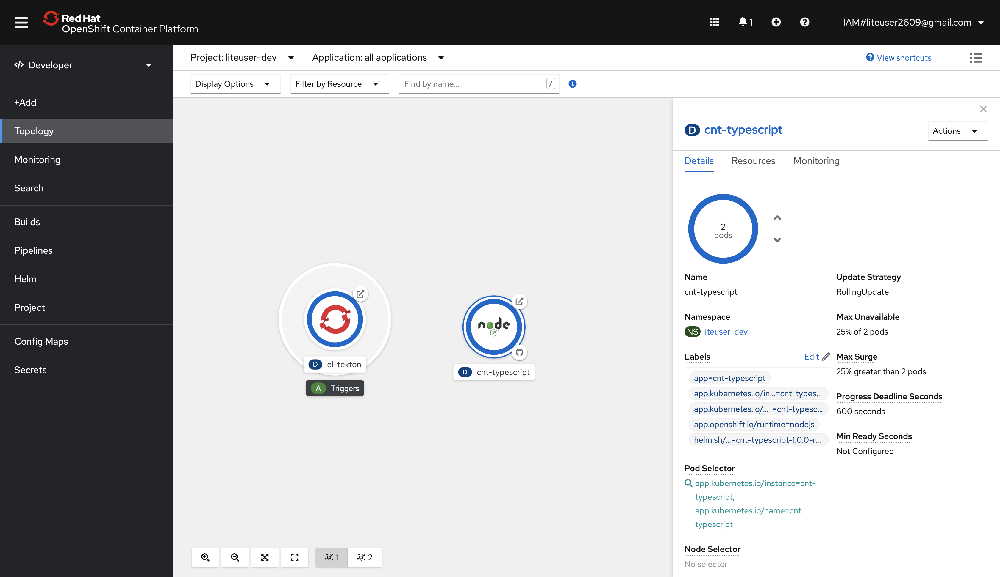

# Create the DevOps pipeline

## Register your application in a DevOps Pipeline

---
:information_source: **Info:** &nbsp; We will be using the pipeline command of the IBM Garage Cloud cli to register the DevOps pipeline. The pipeline command gives an option for both Jenkins and Tekton. For more information about working with the different build engines, please see the [Continuous Integration with Jenkins Guide](https://cloudnativetoolkit.dev/tools/jenkins) and [Continuous Integration with Tekton Guide](https://cloudnativetoolkit.dev/tools/tekton).

---

1. If not already done so, open a separate tab to the Git repository that you've just generated from the Starter Kit template.

2. Copy the repository's URL. For GitHub this is done by pressing the `Code` button and copying the URL provided in the `Clone` section.

3. Next, start the process to create a pipeline.

    ```bash
    $ oc pipeline ${GIT_URL}
    ```

    For example:

    ```bash
    $ oc pipeline https://github.com/eciggaar/cnt-typescript
    ```

4. For the deployment of your first app with OpenShift select **Tekton** as the CI engine.

5. The first time a pipeline is registered in the namespace, the CLI will ask for a username and **Password/Personal Access Token** for the Git repository. These credentials will be stored in a secret named `git-credentials`. 

    * **Username**: Enter your GitHub user id
    * **Personal Access Token**: Paste your GitHub personal access token

6. When registering a `Tekton` pipeline, the CLI will attempt to determine the runtime used by the repository that was provided and filter the available pipelines. If only one matches then it will be automatically selected. If it cannot find a match or there is more than one match then you will be prompted to select the pipeline.

7. When registering a `Tekton` pipeline, the CLI also reads the available parameters from the pipeline and generates prompts for input. In this case, the option to scan the built image for vulnerabilities is the only available option. The scan is performed by the Vulnerability Advisor if you are using IBM Image Registry or by Trivy if another image registry is used. This scan is performed in the "scan" stage of the pipeline after the "img-release" stage.

    ```
    ? scan-image: Enable the pipeline to scan the image for vulnerabilities?(Y/n)
    ```

8. To skip the scan, "n" for (No). Otherwise, type "y" (Yes) for performing a Vulnerability Scan on the image.

9. After the pipeline has been created, the command will set up a webhook from the Git host to the pipeline event listener.

    ---
    :pencil: **Note:** &nbsp; If the webhook registration step fails, it is likely because the Git credentials are incorrect or that you do not have enough permissions in the repository.

    ---

10. When the command is completed it will present options for next steps. You can use the Tekton CLI commands to inspect the pipeline run that has been created and tail the log, and/or navigate to the provided URL to see the pipeline running from the OpenShift console.

## View your application pipeline

The steps to view your registered pipeline will vary based on the type of pipeline (`Jenkins` or `Tekton`) and container platform version. For this workshop we use a Tekton pipeline and OpenShift as container platform. 

1. So for this, use the URL provided in the last step or go the **Pipelines** section in your **OpenShift Web Console** yourself.

2. Then, from the menu on the left switch to the **Developer** mode.

3. Select the development project that was used for the application pipeline registration --- i.e. your `${DEV_NAMESPACE}` project.

4. In the left menu, select **Pipelines**.

    You should see your application DevOps pipeline running. Once completed, the pipeline run will look like the image below.

    


## View your application artifacts

The pipeline built two artifacts for deploying your app:

* **Container image** -- The image registry includes a container image with your app built in.
* **Helm chart** -- The artifact repository includes a Helm chart repository that includes a Helm chart for deploying your app.

Let's look at these artifacts in the Toolkit environment.

This toolkit environment is configured to store the container images in the internal OpenShift image repository.

1. From the **OpenShift console**'s tools menu or from the **Developer Dashboard**'s tools page, select **Image Registry**. This will take you to the interal OpenShift image registry page. To see only the images in your development project, select your development project from the **Projects** dropdown menu. You should now see the images created by the pipeline build.

    

    The Helm chart is stored in Artifactory:

1. From the **OpenShift console**'s tools menu or from the **Developer Dashboard**'s tools page, select **Artifactory**.

2. In the **Artifactory** console, select **Artifactory -> Artifacts -> generic-local**. You'll see a folder, which typically has the name of your cluster. This folder contains a different chart for each build, such as `generic-local/edcig-oc-cnt1/cnt-typescript-0.0.1.tgz`.

    

## Access your running application

---
:pencil: **Note:** &nbsp; Be sure the namespace context is set correctly before running the following commands

---

Once the pipeline has completed successfully, the app will be deployed into the namespace used when registering the pipeline. To validate the app is running follow these steps:

1. Open or switch tab to your Cloud Shell and use the command below to retrieve the application ingress endpoint.

    ```bash
    $ oc endpoints
    ```

2. From the endpoints listed, select the URL for the repo that was just deployed and press Enter to open that URL in a web browser. Validate the application is working as expected.

## Locate the application in the web console

The build pipeline is configured to build the source code from the Git repository into a container image. This image is stored in the Image Registry. After that, the image is deployed into the same namespace / project within the development cluster where the pipeline ran and validated for its health. The steps below will walk you through locating the installed application within the web console.

1. Open the **OpenShift Web Console**.

    ```bash
    $ oc console
    ```

2. Change to the **Developer** view.

3. Click on **Topology** menu.

4. Click on your application deployment in the topology view.

5. Click on the **Overview** tab.

6. Increase the number of running pods to 2 pods.

7. Click on the **Resources** tab to view the list of pods.

8. Click on **View Logs** link to view the logs from each pod.

9. You can see the running state of your application.

    


    **Congrats!!** :smiley: :+1: You now have your application running inside your development cluster and being delivered using a Tekton based CI pipeline. The next step would be to hook your Continuous Delivery tool -- in our case Argo CD -- to the CI pipeline that we've created in this section.

---

__Continue with the next part: [Continous Delivery with Argo CD](4-ContinousDelivery.md)__
