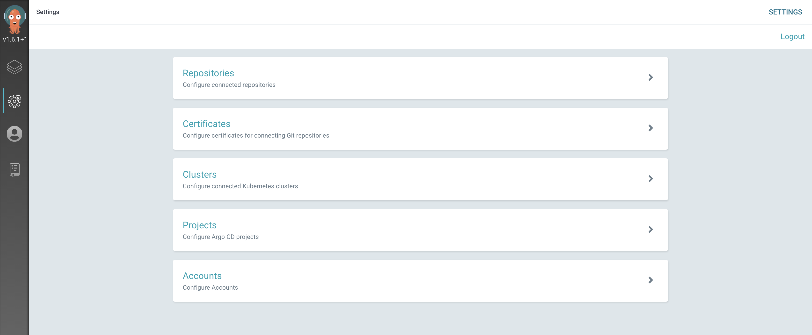

# Continuous Delivery with Argo CD

## What is Argo CD

Argo CD is a declarative, GitOps continuous delivery tool for container platforms like Kubernetes and/or Red Hat OpenShift where the deployment environment is a namespace in the platform.

Argo CD models a collection of applications as a project and uses a Git repository to store the application's desired state.

Argo CD is flexible in the structure of the application configuration represented in the Git repository.

Argo CD supports defining Kubernetes manifests in a number of ways:

* helm charts
* kustomize
* ksonnet
* jsonnet
* plain directory of yaml/json manifests
* custom plugins

Argo CD compares the actual state of the application in the cluster with the desired state defined in Git and determines if they are out of sync. When it detects the environment is out of sync, Argo CD can be configured to either send out a notification to kick off a separate reconciliation process or Argo CD can automatically synchronize the environments to ensure they match.

---
:pencil: **Note:** &nbsp; Confidential information like passwords and security tokens should not be checked into the Git repository. [Managing secrets in Argo CD](https://cloudnativetoolkit.dev/tools/argocd/#managing-secrets-in-argo-cd)) provides information on how to handle confidential information in the GitOps repo.

---

## Configuring GitOps with Argo CD

Argo CD uses a number of terms to refer to the components.

* Application - A deployable unit.

    In the context of the environment, an application is one Helm chart that contains one container image that was produced by one CI pipeline. While Helm charts and images could certainly be combined to make more sophisticated applications in more advanced scenarios, we will be using this simple definition here.

* Project - A collection of applications that make up a solution.

### Set up the GitOps repo

Argo CD uses a Git repo to express the desired state of the Kubernetes environment. The basic setup uses one repository to represent one [project](https://argoproj.github.io/argo-cd/user-guide/projects/). Within that repository, each [application](https://argoproj.github.io/argo-cd/operator-manual/declarative-setup/#applications) that makes up the project will be described in its own folder. The repository also contains a branch for each destination (i.e. cluster and namespace) into which we want to deploy the applications.

---
:pencil: **Note:** &nbsp; There is nothing special about a git repository used for git-ops. All that is required at a minimum is a hosted git repository that is accessible from by the Argo CD instance. The Argo CD Starter Kit used in the following steps is optional and provides some application templates to help simplify some configuration activities.

---

1. Create a new repo from the [Argo CD Starter Kit](https://github.com/IBM/template-argocd-gitops/generate). If you see a 404 error when you click on the link, you need to sign in to github.

2. Copy the repository's URL. For GitHub this is done by pressing the `Code` button and copying the URL provided in the `Clone` section. Then, in your cloud shell, run:

    ```bash
    $ git clone ${GIT_URL_GITOPS}
    ```

3. Navigate into the directory.

    ```bash
    $ cd ${GIT_DIRECTORY}
    ```

4. Create and push test branch.

    ```bash
    $ git checkout -b test
    $ git push -u origin test
    ```

    To be able to push the new `test` branch to the remote repo, you will be asked to provide your Git username and a **Password/Personal Access Token**.

### Hook the CI pipeline to the CD pipeline

The last stage in the CI pipeline updates a GitOps repository with the updated application metadata from the build. In order to do that, the CI pipeline needs to know which repository should be used and needs the credentials to push changes to that repository. As with other configuration within the pipeline, this is handled with config maps and secrets:

* A secret named `git-credentials` holds the credentials the CI pipeline uses to access all the respositories in the Git host (e.g. GitHub, GitLab, BitBucket, etc. If you used the IGC CLI to register the pipeline then this secret has already been created.
* A config map named `gitops-repo` holds the URL and branch for the GitOps repository.

Fortunately the IGC CLI provides a `gitops` command to simplify this step. Information on how to use the command as well as the alternative manual steps can be found in the IGC CLI gitops command section.

1. Make sure to switch context to the project/namespace CI namespace

    ```bash
    $ oc project ${DEV_NAMESPACE}
    ```

2. Run the `gitops` command to create the config map and secret in the CI namespace

    ```bash
    $ igc gitops
    ```

    ---
    :pencil: **Note**

    * For the secret to be available to the CI pipeline, the secret needs to be created in the same namespace where the pipeline is running.
    * The value provided for branch is the one the pipeline will use to when committing changes to trigger the CD pipeline.

    ---

    As of v2.0.0 of the Tekton tasks and the Jenkins pipelines, the CI pipeline will create a folder and the initial configuration for an application deployment if it doesn't already exist. This means, there is no other manual configuration required to set up the repository.

3. Now run a new Pipeline and make sure a directory for the application is created on the GitOps repository. This is required before completing the configuration of Argo CD.

### Configure Release namespaces

Argo CD will deploy the application into the "releases" namespace such as `${TEST_NAMESPACE}` or `${STAGING_NAMESPACE}`.

1. Creat a release namespace where Argo CD will deploy the application:

    ```bash
    $ oc new-project ${TEST_NAMESPACE}
    ```

    Here `${TEST_NAMESPACE}` reflects the name you've chosen for your testing namespace. As we are using the internal OpenShift Image Registry for this workshop, we need to give permission to the services accounts in the "release" namespaces (i.e. your `${TEST_NAMESPACE}` namespace) to be able to pull images from the "development" namespaces (i.e. your `${DEV_NAMESPACE}` namespace). 
    
2. For this, grant access to service accounts in the new `${TEST_NAMESPACE}` to pull the container image from the`${DEV_NAMESPACE}` namespace. 

    ```bash
    $ oc policy add-role-to-group system:image-puller system:serviceaccounts:{TEST_NAMESPACE} -n {DEV_NAMESPACE}
    ```

### Register the GitOps repo in Argo CD

Now that the repository has been created, we need to tell Argo CD where it is. 

1. For this, open the **Developer Dashboard** and click the Argo CD link to open Argo CD.

1. Log into Argo CD by clicking **Login via OpenShift**. 

1. Next, click **Allow selected permissions** to give the `argocd-dex-server` service account `read-only` access to your account.

2. Click on the gear icon on the left menu to access the Settings options.

    

3. Select the **Repositories** option.

4. Click either the **Connect Repo using HTTPS** or **Connect Repo using SSH** button at the top and provide the information for the GitOps repo you just created.

### Create a project in Argo CD

In Argo CD terms, each deployable component is an application and applications are grouped into projects. Projects are not required for Argo CD to be able to deploy applications, but it helps to organize applications and provide some restrictions on what can be done for applications that make up a project.


1. Log into the Argo CD user interface.

2. Click on the gear icon on the left menu to access the **Settings** options.

    

3. Select the **Projects** option.

4. Press the **New Project** button at the top of the page.

5. Specify the properties for the new project

    * Name - Provide the name for the project
        * **Description** - A brief description of the project
        * **Source** - Press Add source and pick the Git repository from the list that was added previously
        * **Destinations** - Add `https://kubernetes.default.svc` for the cluster url and ${TEST_NAMESPACE} for the namespace
        * Press **Create**.

### Add an application in Argo CD for each application component

---
:warning: **Warning:** &nbsp; Before completing the set-up of Argo CD, please verify that the CI Pipeline run created the directory for the application on the GitOps repository and the directory containing the helm related files including `requirements.yaml`.

---

The last step in the process is to define the application(s) within Argo CD that should be managed. This consists of connecting the config within the Git repo to the cluster and namespace.

1. Log into Argo CD user interface.

2. Press **Create Application** or **New App** and provide the following information:

    * **Application Name** - The name of the application. It is recommended to use the format of `{namespace}-{image name}`.
        * **Project** - The Argo CD project with which the application should be included.
        * **Sync pPolicy** - The manner with which Argo CD will use to manage the deployed artifacts. `Automatic` is recommended.
        * **Repository URL** - The GitOps URL where the configuration is stored (restricted to git URLs configured in the Argo Project).
        * **Revision** - The Git branch where the configuration for this instance is stored. This would `test` in our case.
        * **Path** - The path within the repository where the application config is located (should be the application name).
        * **Cluster** - The destination cluster URL for the deployment.
        * **Namespace** - The namespace where the application should be deployed (restricted to namespaces configured in the Argo Project).

3. Finally, repeat that step for each application and each environment.

**Congrats!!** :smiley: :+1: You successfully completed all steps in the workshop. You learned leveraging the toolkit to create an application, register a pipeline for and the app and connect to your source repo. Finally you learned how to hook the GitOps Argo CD to your CI pipeline to 

* create ahow tonow have your application running inside your development cluster and being delivered using a Tekton based CI pipeline. The next step would be to hook your Continuous Delivery tool -- in our case Argo CD -- to the CI pipeline that we've created in this section.

Having reached this point, we recommend you repeat the process a few more times using different Code Patterns templates and explore the Developer view in OpenShift to get familiar with it.
