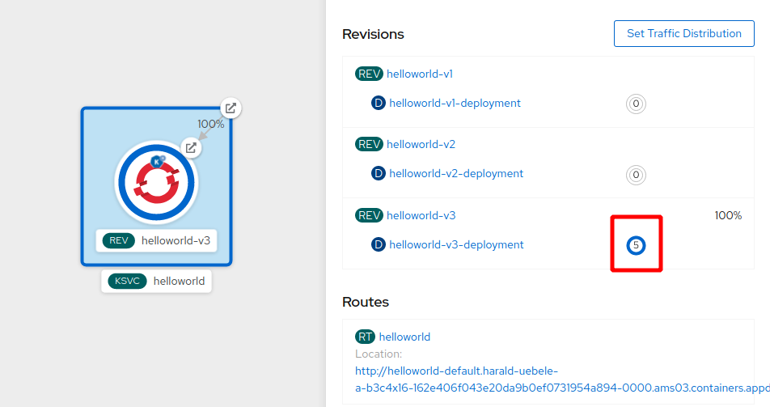

# Knative Auto-Scaling

Scale to zero is an interesting feature but without additional tricks (like pre-started containers or pods, which aren't available in Knative) it can be annoying because users may have to wait until a new pod is started and ready to receive requests. Or it can lead to problems like time-outs in a microservices architecture if a scaled-to-zero service is called by another service and has to be started first and takes some time to start (e.g. traditional Java based service). 

On the other hand, if our application / microservice is hit hard with many requests, a single pod may not be sufficient to serve them and we may need to scale up. And preferably scale up and down automatically.

Auto-scaling is accomplished by simply adding a few annotation statements to the Knative Service description, *service-v3-scaling.yaml*:

```yaml
apiVersion: serving.knative.dev/v1
kind: Service
metadata:
  name: quarkus-hello-world
spec:
  template:
    metadata:
      name: quarkus-hello-world-v3
      annotations:
        # the minimum number of pods to scale down to
        autoscaling.knative.dev/minScale: "1"
        # the maximum number of pods to scale up to
        autoscaling.knative.dev/maxScale: "5"
        # Target in-flight-requests per pod.
        autoscaling.knative.dev/target: "1"
    spec:
      containers:
        - image: image-registry.openshift-image-registry.svc.cluster.local:5000/devops-workshop/quarkus-hello-world:19e3c62ae20b65ab977a1000a1bdec002e753120
          env:
            - name: GREETING_MESSAGE
              value: "Hello DevOps Workshop v3 -- Scaling"
  traffic:
    - tag: v3
      revisionName: quarkus-hello-world-v3
      percent: 100              
```

* `minScale: "1"` prevents scale to zero, there will always be at least 1 pod active.
* `maxScale: "5"` will allow to start a maximum of 5 pods.
* `target: "1"` limits every started pod to 1 concurrent request at a time, this is just to make it easier to demo. 

You can also [scale based on CPU usage or number of requests](https://cloud.ibm.com/docs/containers?topic=containers-serverless-apps-knative#scale-cpu-vs-number-requests).

1. Deploy the update to the Knative service as usual. That is, 

  ```bash
  $ cd ~/devops-workshop/scripts
  $ oc apply -f knative/service-v3-scaling.yaml
  ```

1. Netx, download the `hey` load generator tool into your IBM Cloud Shell session and make it executable:

   ```bash
   $ cd ~
   $ wget https://hey-release.s3.us-east-2.amazonaws.com/hey_linux_amd64
   $ mv hey_linux_amd64 hey
   $ chmod +x hey
   ```

1. In the OpenShift Web Console, Topology view, notice that 1 pod is started. This 1 pod will not scale to zero (`minScale: "1"`).

1. In the OpenShift Web Console copy the URL/link location of the Route.
   
1. In the IBM Cloud Shell session generate some load on this copied URL:
   (Don't forget the './' !)

   ```bash
   $ ./hey -z 30s -c 50 http://hellojfall-....appdomain.cloud   
   ```

   The 

1. Switch over to OpenShift Web Console and watch the pod count go up to 5:

     

1. Check the output of the `hey`command, for example the histogram:
  
   ```
    Response time histogram:
    0.009 [1]     |
    0.035 [47400] |■■■■■■■■■■■■■■■■■■■■■■■■■■■■■■■■■■■■■■■■
    0.061 [9506]  |■■■■■■■■
    0.087 [557]   |
    0.113 [117]   |
    0.139 [41]    |
    0.165 [10]    |
    0.191 [7]     |
    0.217 [5]     |
    0.244 [7]     |
    0.270 [33]    |
   ```
  
   None of the requests took much longer than a quarter of a second. That's because one pod is always started and can take the first so many requests.
  
**This concludes the part 1 of the DevOps workshop.**   